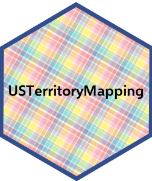

# USTerritoryMapping

Something I hear a lot as an applied territorial epidemiologist is that the territories are excluded from national maps due to the trickiness of inset mapping. Thus, the goal of this R package is to make it easier to plot US maps that include the US territories, specifically American Samoa, Guam, Northern Mariana Islands, Puerto Rico, and the US Virgin Islands.

Initial release includes two functions for choropleth mapping a categorical variable at the state and territory level. `map1_categorical()` allows for mapping of territory geometries, while `map2_categorical()` allows for mapping of territory labels.

[Vignette](http://htmlpreview.github.io/?https://github.com/Katie-Labgold/USTerritoryMapping/blob/main/doc/introduction.html)

Any feedback is welcome. Happy mapping!



Thank you to Dr. Musheng Alishahi, Liz Lamere, and Dr. Elizabeth Slocum for their feedback in developing and testing this package.

# Installation
```
#install.packages("devtools")
library(devtools)
devtools::install_github("Katie-Labgold/USTerritoryMapping")
```
