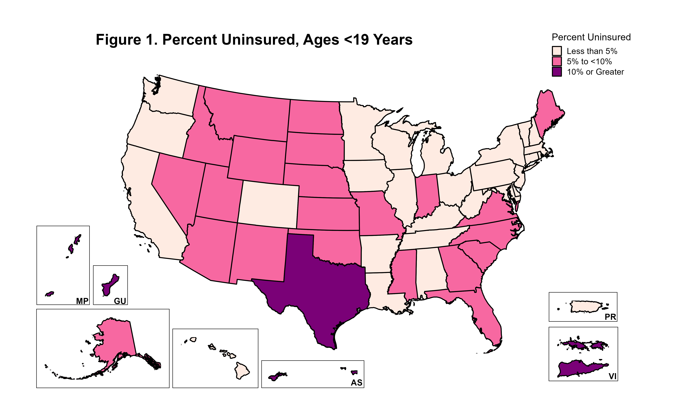
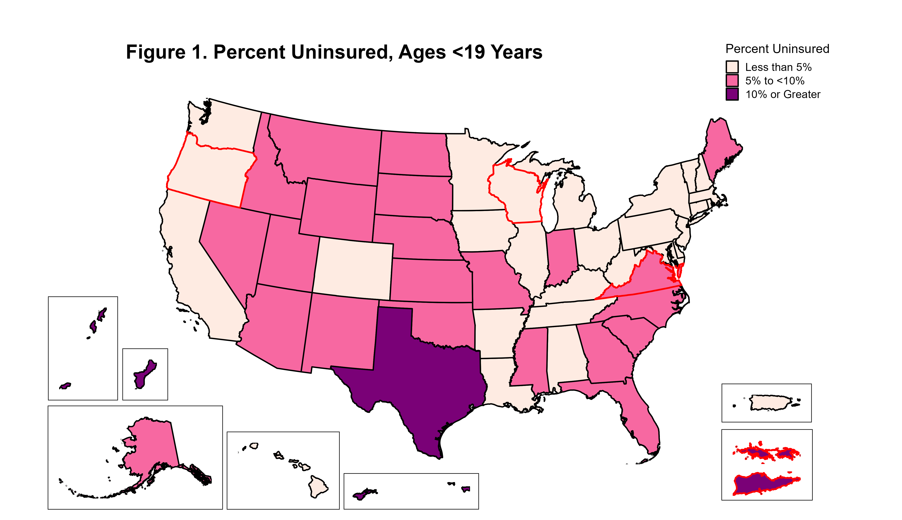
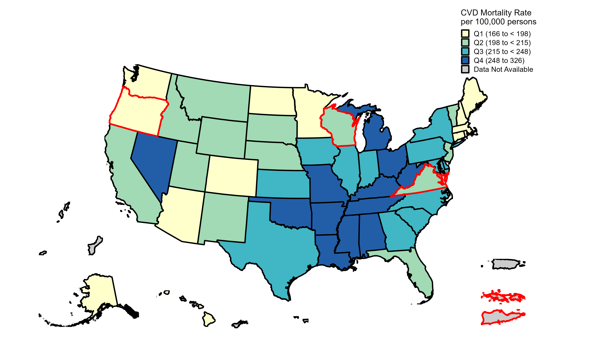
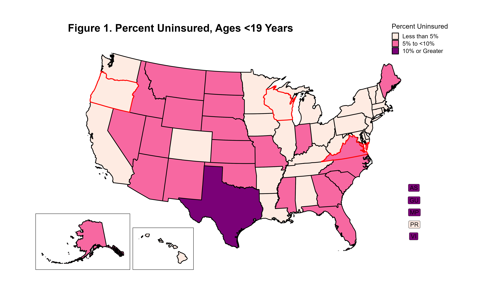
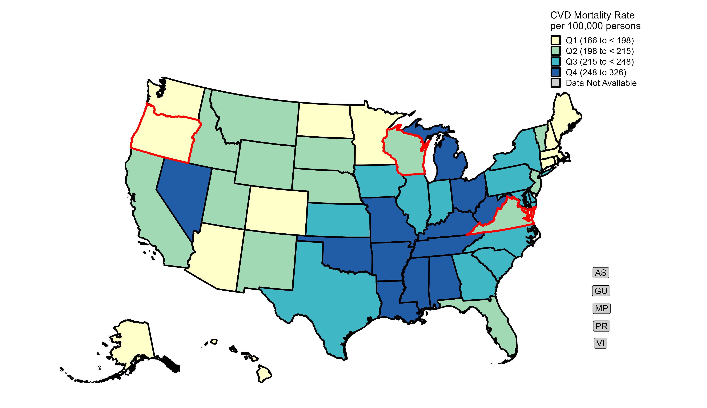

```{r, include = FALSE}
knitr::opts_chunk$set(
  collapse = TRUE,
  comment = "#>"
)
```

# Introduction

This vignette gives an overview of the USTerritoryMapping package, which is seeks to make creating categorical choropleth maps of the US that include the US territories a little bit easier!

First load the package. 
```{r setup}
library(USTerritoryMapping)
```


# Prepare Data

To use this package, you will need to have a dataframe with (1) a categorical variable coded as a factor and (2) a column with the two-letter US Postal Service code for each state and territory (e.g., VA for Virginia or VI for Virgin Islands). `fipscodes.rda` is provided to facilitate #2.

For this vignette, we'll be using the two provided datasets `census.uninsured19` and `cdc.cvd`. `census.uninsured19` provides an example of a dataset with complete data for all states and territories, while `cdc.cvd` is missing values for territories.

```{r}
data(census.uninsured19)
data(cdc.cvd)
```

We can see that each dataset has these two components.
In `census.uninsured19`: (1) "Percent.Cat" which is the Percentage Ages 19 or Under with No Health Insurance, and (2) "LocationAbbr".

```{r}
class(census.uninsured19$Percent.Cat)
table(census.uninsured19$Percent.Cat)
head(census.uninsured19$STUSPS)
```

In `cdc.cvd`: (1) "data.cat" which is the CVD mortality rate per 100,000 persons, and (2) "LocationAbbr". 

```{r}
class(cdc.cvd$data.cat)
table(cdc.cvd$data.cat)
head(cdc.cvd$LocationAbbr)
```

# Mapping US with Territory Geometries

## Using Census Insurance Data

Start by defining the fill category colors with their factor labels.

```{r}
colors.census <- c("Less than 5%" = "#feebe2", 
                    "5% to <10%" = "#f768a1", 
                    "10% or Greater" = "#7a0177")
```


```{r, warnings = FALSE, message = FALSE, eval = FALSE}
map1_categorical(data = census.uninsured19, 
                 join_var = "STUSPS", 
                 fill_var = "Percent.Cat", 
                 fill_color = colors.census, 
                 legend_name = "Percent Uninsured",
                 territory_label_color = "black",
                 title = "Figure 1. Percent Uninsured, Ages <19 Years",
                 save.filepath = "saved-maps/map1-uninsure.png")
```

{width=850px}

Let's say we wanted to add a border to highlight specific states. We'll first define a vector of IDs and then use the border_ids parameter.

```{r, warnings = FALSE, message = FALSE, eval = FALSE}
border <- c("OR", "WI", "VA", "VI")

map1_categorical(data = census.uninsured19, 
                 join_var = "STUSPS", 
                 fill_var = "Percent.Cat", 
                 fill_color = colors.census, 
                 legend_name = "Percent Uninsured",
                 title = "Figure 1. Percent Uninsured, Ages <19 Years",
                 border_ids = border,
                 border_color = "red",
                 border_linewidth = 1,
                 save.filepath = "saved-maps/map1-uninsure2.png")
```

{width=850px}

## Using CDC Cardiovascular Disease Mortality Data

We highlight the additional option of removing the inset box by specifying `inset_box_color = "white"`. We also highlight the additional option of removing the territory labels by specifying `territory_label_color = "white"`.

```{r, warnings = FALSE, message = FALSE, eval = FALSE}
colors.cdc <- c("Q1 (166 to < 198)" = "#ffffcc",
                 "Q2 (198 to < 215)" = "#a1dab4",
                 "Q3 (215 to < 248)" = "#41b6c4",
                 "Q4 (248 to 326)" = "#225ea8")

map1_categorical(data = cdc.cvd, 
                 join_var = "LocationAbbr",
                 fill_var = "data.cat", 
                 fill_color = colors.cdc, 
                 fill_linewidth = 1.2,
                 fill_linecolor = "black",
                 inset_box_color = "white",
                 territory_label_color = "white",
                 legend_name = "CVD Mortality per 100,000",
                 border_ids = border,
                 border_color = "red",
                 border_linewidth = 1.5,
                 save.filepath = "saved-maps/map1-cvd.png") 
```

{width=850px}

# Mapping US with Territory Labels

You may also want a map with the territory labels filled by value rather than the geometries.

```{r, warnings = FALSE, message = FALSE, eval = FALSE}
colors.census <- c("Less than 5%" = "#feebe2", 
                    "5% to <10%" = "#f768a1", 
                    "10% or Greater" = "#7a0177")

border <- c("OR", "WI", "VA", "VI")

map2_categorical(data = census.uninsured19, 
                 join_var = "STUSPS", 
                 fill_var = "Percent.Cat", 
                 fill_color = colors.census, 
                 legend_name = "Percent Uninsured",
                 title = "Figure 1. Percent Uninsured, Ages <19 Years",
                 border_ids = border,
                 border_color = "red",
                 border_linewidth = 1,
                 save.filepath = "saved-maps/map2-uninsure.png")
```

{width=850px}

Note that the territory labels cannot be highlighted, even when specified in the border ID vector.

```{r, warnings = FALSE, message = FALSE, eval = FALSE}
colors.cdc <- c("Q1 (166 to < 198)" = "#ffffcc",
                 "Q2 (198 to < 215)" = "#a1dab4",
                 "Q3 (215 to < 248)" = "#41b6c4",
                 "Q4 (248 to 326)" = "#225ea8")

map2_categorical(data = cdc.cvd, 
                 join_var = "LocationAbbr",
                 fill_var = "data.cat", 
                 fill_color = colors.cdc, 
                 fill_linewidth = 1.2,
                 fill_linecolor = "black",
                 inset_box_color = "white",
                 legend_name = "CVD Mortality per 100,000",
                 border_ids = border,
                 border_color = "red",
                 border_linewidth = 1.5,
                 save.filepath = "saved-maps/map2-cvd.png") 
```

{width=850px}